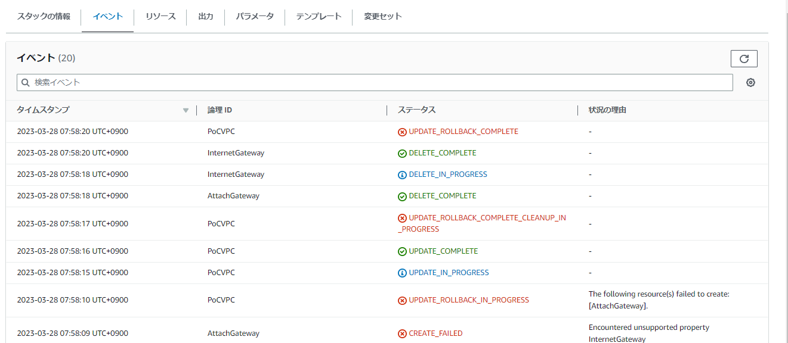

# A CloudFormationを直書きしてみる

最終的なファイルは A_templates 以下にある。

まずはcloudformation template を直書きしてみようと、

[CloudFormation入門】5分と6行で始めるAWS CloudFormationテンプレートによるインフラ構築](https://dev.classmethod.jp/articles/cloudformation-beginner01/)

を読む。


以下のtemplate を記述した。

```yaml
AWSTemplateFormatVersion: '2010-09-09'
Resources:
  PoCVPC:
    Type: AWS::EC2::VPC
    Properties:
      CidrBlock: 10.3.0.0/16
      Tags:
      - Key: Name
        Value: PoCVPC
```

CloudFormation コンソールから手動で以上のtemplateを登録したところ、以下のVPCが作成された。


次に、以下の内容にtemplateを書き換え、「アクションー＞既存スタックの変更セットの作成」から再度CloudFormationにuploadした

```yaml
AWSTemplateFormatVersion: '2010-09-09'
Resources:
  PoCVPC:
    Type: AWS::EC2::VPC
    Properties:
      CidrBlock: 10.3.0.0/16
      Tags:
      - Key: Name
        Value: PoCVPC
  InternetGateway:
    Type: AWS::EC2::InternetGateway
    Properties:
      Tags:
      - Key: Name
        Value: PoCVPC-IGW
  AttachGateway:
    Type: AWS::EC2::VPCGatewayAttachment
    Properties:
      VpcId: !Ref PoCVPC
      InternetGateway: !Ref InternetGateway
  FrontendRouteTable:
    Type: AWS::EC2::RouteTable
    DependsOn: AttachGateway
    Properties:
      VpcId: !Ref PoCVPC
      Tags:
      - Key: Name
        Value: PoCVPC-FrontendRoute
  FrontendRoute:
    Type: AWS::EC2::Route
    DependsOn: AttachGateway
    Properties:
      RouteTableId: !Ref FrontendRouteTable
      DestinationCidrBlock: 0.0.0.0/0
      GatewayId: !Ref InternetGateway
  FrontendSubnet:
    Type: AWS::EC2::Subnet
    DependsOn: AttachGateway
    Properties:
      CidrBlock: 10.0.1.0/24
      MapPublicIpOnLaunch: true
      VpcId: !Ref PoCVPC
      Tags:
      - Key: Name
        Value: PoCVPC-FrontendSubnet
  FrontendSubnetRouteTableAssociation:
    Type: AWS::EC2::SubnetRouteTableAssociation
    Properties:
      SubnetId: !Ref FrontendSubnet

```


アップロードしただけでは更新はかからず、変更セットが作成された。
「変更セットを更新」を、改めて押下すると、更新がかかった。


しかし、設定が間違っていたようで以下のエラーが発生した。



AttachGatewayのInternetGatewayを、InternetGatewayId に修正するなど、２～３回修正したのちに、想定通りにプロヴィジョニングされることを確かめた。

設定のミスは validate-template を実行することで発見できる。


# B SDKを使ってみる

## サンプル構成をデプロイしてみる

AWS CLI の認証設定をしたうえで、

B_SDK の中で
- `cdk init sample-app --language typescript` を実行。
- `cdk bootstrap`を実行

SQS と SNS が作成された。

## サンプル構成を削除してみる

`cdk destroy` で削除できた。

# C 多層アーキテクチャで RDB+web-server+LB を構築してみる

C_MutilStack_CDK の中で実験した。

` cdk deploy '*' --require-approval never` で実行
` cdk destroy '*' --force` で破壊


## 構成

- ALB から autoscaling group　の　frontend にアクセスする構成
- RDS もデプロイだけしているが、接続設定はしていない

## 結果

- ALB　から apacheにアクセスすることに成功した。
- スタック間の依存関係を正しく記述しないと、ライフタイムが長いものがライフタイムに依存してしまう事態になりかねない。暗黙的に依存解決されるが、コード中にも依存を明記し、それと依存解決の向きが逆転していたら明確にsynthが落ちるようにしておいた方が安全そう
